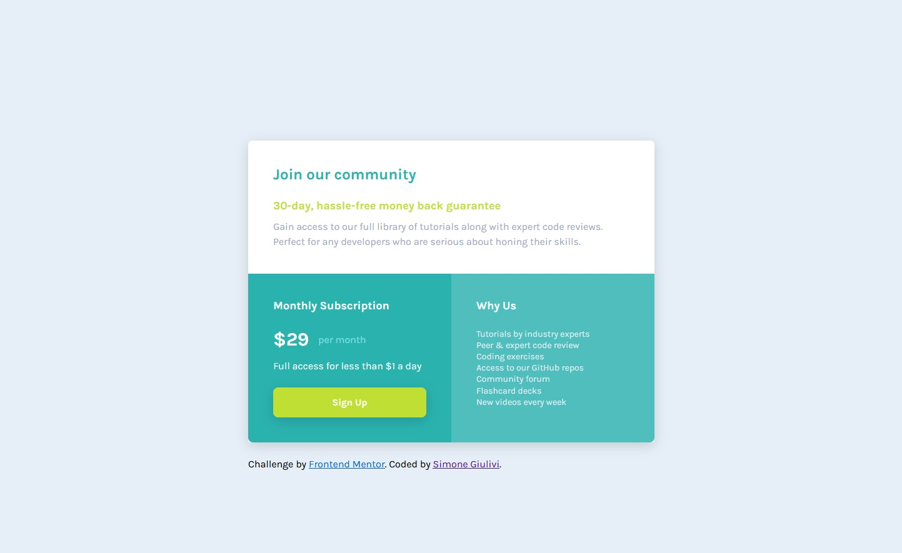

# Frontend Mentor - Single price grid component solution

This is a solution to the [Single price grid component challenge on Frontend Mentor](https://www.frontendmentor.io/challenges/single-price-grid-component-5ce41129d0ff452fec5abbbc). Frontend Mentor challenges help you improve your coding skills by building realistic projects.

## Table of contents

- [The challenge](#the-challenge)
- [Screenshot](#screenshot)
- [Links](#links)
- [Continued development](#continued-development)
- [Author](#author)
- [Acknowledgments](#acknowledgments)

### The challenge

Users should be able to:

- View the optimal layout for the component depending on their device's screen size
- See a hover state on desktop for the Sign Up call-to-action

### Screenshot

### Links

- Solution URL: [Solution URL](https://github.com/Giulo25/Single-price-grid-component)
- Live Site URL: [Add live site URL here](https://your-live-site-url.com)

## Author

- Website - [Simone Giulivi](https://www.simonegiulivi.com)
- Frontend Mentor - [@Giulo25](https://www.frontendmentor.io/profile/Giulo25)

## Acknowledgments

For the prize sectione put the prize inside a span inside a div, then make the div display: flex and use align-item: center to align vertically "per month" to the prize.
